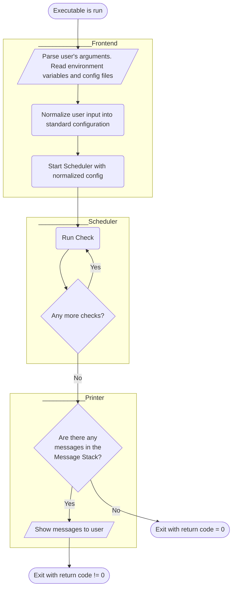

# Development
This file documents the purpose and architecture of programs contained in this repository.
It is meant to serve as an introduction to new developers and a guideline for development. It is expected that
new code will abide to these guidelines.

## Purpose
Provide linters that complement [`pylint-odoo`](https://github.com/OCA/pylint-odoo). `pylint-odoo` is focused on
checking Python source code, which means linters in this project focus solely on the following types of files:

* csv
* po
* xml

As the name of the repository implies, all linters in this project must be compatible with
[`pre-commit`](https://pre-commit.com/). This means **all linters must comply with the following points:

* provide an entrypoint in the form of an executable which takes (at least) filenames as arguments
* nonzero exit on failure

A linter is considered to have failed once it emits a message.

## Nomenclature
* Linter: An executable (entry point) which runs checks and emits messages.
* Check: A routine inside a linter, verifies the source code conforms to a certain rule (or rules).
* Message: **Generated by checks** when a rule is not met. **Emitted by linters**.

Why is this last point important? Checks must be self-contained units which perform a single task: verify the source
conforms to the rule it checks for. This improves testability.

## Checks
Checks are run by linters. The nature of checks can be divided in two categories:

* Dependent
* Independent

### Dependent Checks
These are checks that depend on other files. **The check must process all its dependencies everytime it runs**. Most
times these dependencies consist of all files of the same type inside an
[Odoo module](https://www.odoo.com/documentation/16.0/developer/howtos/backend.html). An example of a dependent
check is `xml-duplicate-record-id`.

This check must read all `<record>` tags inside a module and verify none of them share the
same id (`<record id="...">`), `<record>` tags are found in **xml** files, so this check **must read all xml files in
a module**.

### Independent Checks
These checks have no dependencies. They only need to process the very file they are checking. An example would be
`xml-deprecated-node`. This check ensures there are no `<data>` tags in xml files.

## Messages
Messages are generated by checks, but emitted by linters. They alert the user about failure to meet one of the
rules verified by checks. They are a standardized in a dataclass. **All compliant checks must only generate
messages in their standardized format (see Architecture Specs).

## Linters
Linters are programs executed by the user to run various checks. They are separated based on the types of checks they
run. **Linters must contain only one type of check (dependent or independent).**

> **Warning**
> Running independent and dependent checks inside the same linter will nullify one feature of `pre-commit`: performing
> checks only on files which have been modified.

Linters are composed of five elements:

* **Frontend**: Command line executable. **In charge of parsing all user input**. User input not only consists of
command line arguments, but also environment variables and configuration files. Said configuration files may not be
explicitly stated by the user and may reside in default locations. It needs to normalize all user input into a common
format for the next component, the *scheduler*.
* **Scheduler**: Gathers all checks for the linter and runs the *necessary* checks in an orderly manner. Note the word
*necessary*. Certain messages may be disabled
(either trough command line arguments, environment variables or a configuration file). The scheduler must detect this
cases and stop the checks that generate said messages from running.
* **Checks**: Self contained function which takes a list of arguments and if necessary generates messages.
* **Message Stack**: Stores all messages generated during the execution of checks.
* **Printer**: Reads messages from the message stack and generates the corresponding output. Generally in the form
of text to `stdout`.



## Architecture Specs
Based on the components and their definitions mentioned below the following architecture is proposed. It tries to be
as standard and strict as possible in order to streamline development and reduce the creation of
technical debt, but provides means to customize behavior if necessary (for those edge cases)

*Note: The following code examples have been reduced as they are meant as grand scheme examples and not a detailed
implementation.*

### Frontend
The main task for the frontend is parsing user's configuration and normalizing into a common format for the Scheduler.
To enforce the format, it has been declared into a dataclass.

In the case of dependent linters, `filenames` shall consist solely of `__manifest__.py` files. The manifest file
states all source code files (outside of Python) and lets the scheduler calculate any dependencies which need to be
checked.

For independent linters, `filenames` consists of all files to be checked. Ideally these will only be those changed
by the current commit.

### Scheduler and Lifecycle
As stated before, the scheduler must run all necessary checks. Besides running checks it also needs to run
the following "Lifecycle methods":

* `check_loop` - Runs all checks in the linter against a file.
* `on_global_open` - Runs just before checks start being run.
* `on_global_close` - Runs after all checks have run. The scheduler will yield control of the program after calling this method.
* `on_open` - Runs before a check loop starts.
* `on_close` - Runs after a check loop. The next check loop (if any) will be run after this

### Message Stack
Stores all messages generated by checks. Must implement (at least) the following method:

* `store_message` - Stores a new message into the stack.

### Printer
Produces output for the user to see. This output should contain all messages generated by checks. Alternatively,
the user can choose to display messages that can be generated by the linter instead of linting files. The printer
must produce said output too (message descriptions).

### Abstract Super Class
In order to enforce the structure and flow described in this document an abstract class is used. **All
compliant linters must be subclasses of it**. In order to keeps thing simple the
linter is encompassed in just one class, the five components are just a mental construct used to organize concerns,
in practice they are all implemented in the linter.

```python
from abc import ABCMeta, abstractmethod
from argparse import ArgumentParser
from dataclasses import dataclass
from typing import Mapping


@dataclass
class Message:
  key: str  # Contains the message-id, for example xml-duplicate-record-id
  file: str  # Absolute path to the file which committed the violation
  args: tuple = tuple()  # Extra arguments used by the Printer to format the message
  # The following values won't be shown to the user if they are negative.
  line: int = -1  # Optional. Line in the file where the violation was found.
  column: int = -1  # Optional. Column where the violation happened.


@dataclass(frozen=True)
class SchedulerConfiguration:
  filenames: list[str]  # Files to run the checker on.
  enable: list[str]  # All enabled messages.
  disable: list[str]  # All disabled messages.
  list_msgs: bool = False  # Do not run any checks. Just print out the messages this linter emits.
  zero_exit: bool = False  # If true the linter will always produce 0 as a return code.
  kwargs: dict = None  # Extra arguments which can be used for customization. Implementation dependent.


class AbstractLinter(ArgumentParser, metaclass=ABCMeta):
  _messages: Mapping[str, str] = None

  def __init__(self):
    self.add_argument("filenames")
    self.add_argument("--enable")
    self.add_argument("--disable")
    self.add_argument("--zero-exit")

  # Lifecycle
  def on_global_open(self): pass
  def on_global_close(self): pass
  def on_open(self): pass
  def on_close(self): pass

  @abstractmethod
  def get_exit_status(self) -> int:
    pass

  # Entrypoint (this runs when  the user calls the executable)
  def run(self, args) -> int:
    # Frontend is called
    config = self.generate_config(args)
    if config.list_msgs:
      self.print_message_descriptions()
      return 0

    # Scheduler starts with a call to _on_global_open
    self.on_global_open()
    # Files get linted. A check loop is run per file.
    for file in config.filenames:
      self.perform_check_run(file)
    # Scheduler ends with a call to _on_global_close
    self.on_global_close()

    self.print_generated_messages()

    return self.get_exit_status()

  # Frontend
  @abstractmethod
  def generate_config(self, args) -> SchedulerConfiguration:
    pass

  # Scheduler
  @abstractmethod
  def _check_loop(self, file: str):
    pass

  def perform_check_run(self, file: str):
    self.on_open()
    self._check_loop(file)
    self.on_close()

  # Message Stack
  def add_message(self, message: Message):
    if message.key not in self._messages:
      raise ValueError(f"Message type ${message.key} is not generated by this linter.")

    self._store_message(message)

  @abstractmethod
  def _store_message(self, message: Message):
    pass

  # Printer
  @abstractmethod
  def print_generated_messages(self):
    pass

  @abstractmethod
  def print_message_descriptions(self):
    pass
```

## pre-commit Integration
[pre-commit](https://pre-commit.com/) is a tool that integrates with Git to automatically run checks before
committing changes. It uses Git Hooks to accomplish this. Two important features are `require_serial` and the ability
to run lints on only files that have been changed.

`require_serial` lets linters run in parallel processes. This speeds up the linting process and is generally a nice
thing to have. Linting the minimum amount of files needed (only those that have changed) is also a great benefit as it
reduces CPU usage/time (and saves money).

### Independent Linters
All compliant Independent Linters can and should run (if possible) as parallel processes. As of
writing this, [it is this way by default](), so no extra configuration needs to be performed. They should also lint
only files of their type that have been modified. This is also the default.

A sample configuration for this type of linter could be:
```yaml
# .pre-commit-hooks.yaml
- id: independent-csv-checker
  name: check csv files
  entry: csv-checker
  types: [csv]
```

### Dependent Linters
Dependent Linters can't run in parallel processes, since they need the same context in order to detect stuff like
duplicate IDs. This means their entry in `.pre-commit-hooks.yaml` must contain `require_serial: true`.

They can run only when files of their type (csv, po, xml) are changed. For example, there is no sense
in running an XML Linter (and looking for duplicated ids) if only .po or .csv files were changed.
Using the same example, they do have to run if just a single XML file has been changed, and they need to run on
all XML files *in the module*.

Emphasis is on *module*, if `views.xml` from the module `sale_management` is changed, there is no need to check files
in other modules. Context is limited to the module in this case. A sample configuration for this type of
linter would be:

```yaml
# .pre-commit-hooks.yaml
- id: dependent-xml-checker
  name: check xml files
  require_serial: true
  entry: xml-checker
  types: [xml]
```

Following the example before, if `views.xml` is changed, `pre-commit` will pass it to the executable as part of
the `filenames` argument. Initially the dependent linter will only have a xml file in its filenames
(it needs all xml files in said module). This is where the flexibility provided by separating concerns comes into
place.

The Frontend receives `views.xml` as the only file. This Frontend has been written for Dependent Linters, so it knows
it needs all XML files. Therefore, it finds the module `views.xml` belongs to, reads it `__manifest__.py` and
generates a `SchedulerConfiguration` whose `filenames` contain all the module's XML files it found. This configuration
is passed to the scheduler and all checks run as expected.
